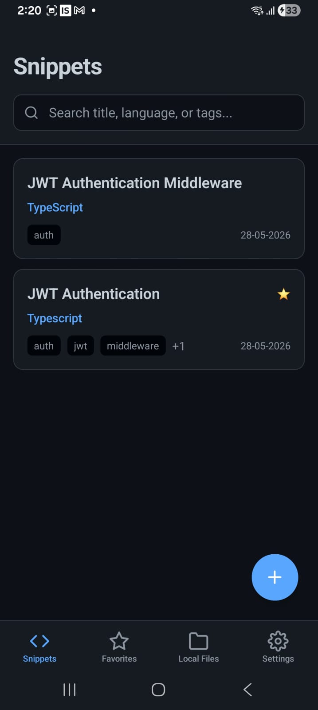
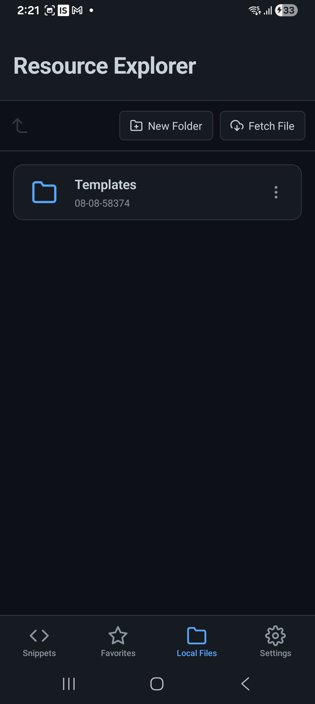
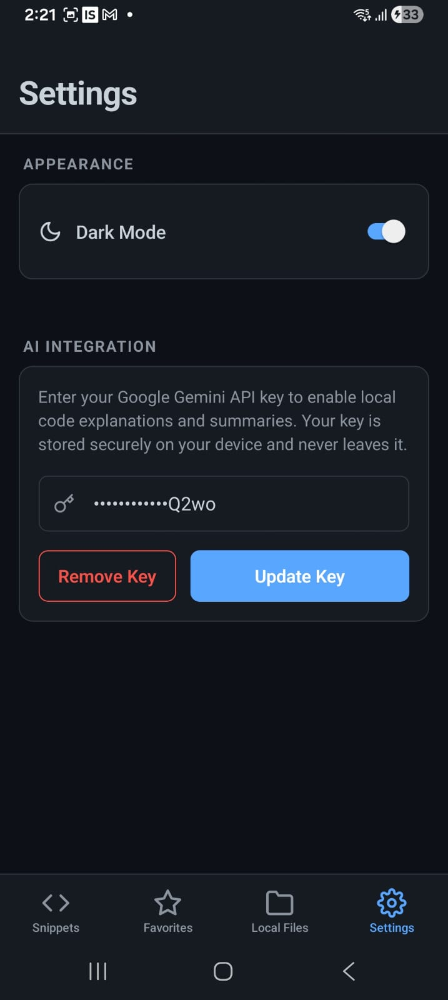
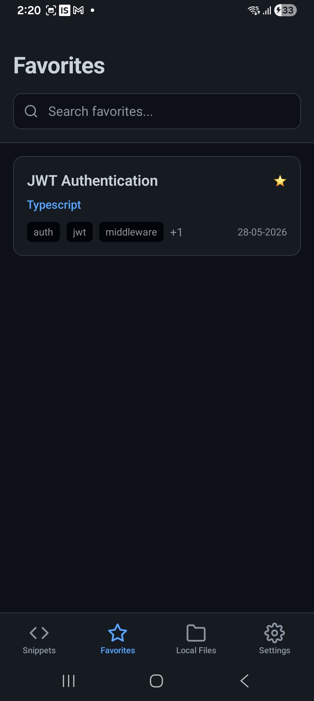
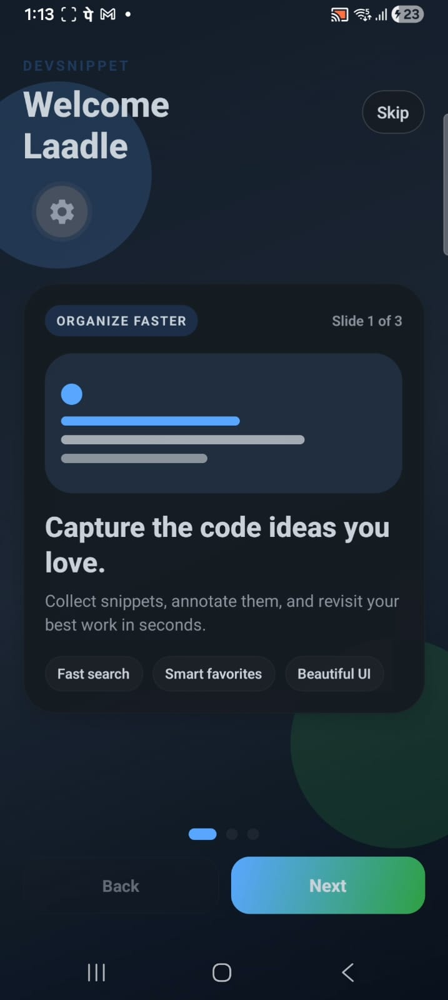

# DevSnippet

DevSnippet is a mobile-first Expo app for managing code snippets, attachments, resources, and generated explanations. It is built with Expo Router, React Native, TypeScript, Zustand, and local SQLite storage.

## Demo Video

https://youtu.be/hFZWu8juZr4?si=VY4yzI4LPAthmrWI

## Screenshots

### App walkthrough

| Snippet list                                         | File manager                                          | AI explanation                                             |
| ---------------------------------------------------- | ----------------------------------------------------- | ---------------------------------------------------------- |
|  |  |  |

### Additional screens

| Favorites                                               | Onboarding                                               | Settings                                             |
| ------------------------------------------------------- | -------------------------------------------------------- | ---------------------------------------------------- |
|  |  |  |

## App Features

- Create, edit, delete, and favorite code snippets
- Store snippet title, body content, language, and tags
- Attach files to snippets and store attachments locally
- Built-in file manager for attachments and custom resource directories
- Download templates, create folders, move files, and delete resources
- Export snippets into `.js`, `.json`, `.txt`, `.cpp`, and `.java`
- AI-powered code explanation using Google Gemini
- Offline-first local persistence with SQLite and AsyncStorage
- Theme and settings stored locally for fast app startup

## Architecture Overview

This project is built with Expo, React Native, and Expo Router. It uses TypeScript and Zustand for local state management.

### Key directories

- `src/app/` - app screens and route definitions
- `src/core/` - app infrastructure for AI, storage, database, filesystem
- `src/features/` - domain logic for snippets, files, settings
- `src/shared/` - shared utilities, theme, hooks, and helpers

## Database Structure

The app uses a local SQLite database to persist snippets and attachment metadata.

### `snippets`

- `id TEXT PRIMARY KEY` — unique snippet identifier
- `title TEXT NOT NULL` — snippet title
- `content TEXT NOT NULL` — snippet code or text content
- `language TEXT NOT NULL` — programming language label
- `tags TEXT NOT NULL` — JSON-encoded tag list
- `is_favorite INTEGER NOT NULL DEFAULT 0` — favorite flag
- `created_at INTEGER NOT NULL` — timestamp in milliseconds

### `attachments`

- `id TEXT PRIMARY KEY` — unique attachment identifier
- `snippet_id TEXT NOT NULL` — foreign key to `snippets.id`
- `file_name TEXT NOT NULL` — attachment filename
- `file_uri TEXT NOT NULL` — local file URI for the stored attachment
- `created_at INTEGER NOT NULL` — timestamp in milliseconds

### Relationships

- `attachments.snippet_id` references `snippets.id`
- Removing a snippet deletes its associated attachment metadata and files

## Offline Storage Approach

The app is designed to work offline for local snippet management and file access.

- `expo-sqlite` stores snippet data and attachment relationships locally
- `@react-native-async-storage/async-storage` stores settings such as theme preference and first-launch state
- `expo-file-system` stores attachments and resource files inside app document storage
- AI generation is the one network-dependent feature; everything else works offline

## File Management Implementation

The file manager is implemented using Expo's filesystem API.

### Directories

- `app_snippets_attachments` — attachment files for snippets
- `app_snippets_resources` — user-created folders, downloaded templates, and resource files

### Supported operations

- List and navigate folders
- Create new folders
- Download external templates into a target folder
- Move files between folders
- Delete files and folders

### Attachment workflow

- Attachments are copied from a temporary source URI to the attachment directory
- Metadata is saved to the `attachments` SQLite table
- The snippet detail screen loads attachments for the current snippet
- Attachments are visible in the file manager and can be removed safely

## AI Integration Workflow

AI explanation is integrated through an external model endpoint.

### How it works

1. The snippet detail screen requests an explanation
2. The app loads the stored API key from secure storage
3. It checks network connectivity with `expo-network`
4. It sends a request to Google Gemini's generation endpoint
5. The returned explanation is displayed in the app

### Error handling

- Shows an error if the API key is missing
- Shows an offline error if there is no internet connection
- Shows a generic explanation failure message for other request issues

## Bonus Features

- Multi-format snippet export including `.cpp` and `.java`
- AI explanation generation for code snippets
- Dual-file manager views for attachments and resources
- Secure theme persistence with AsyncStorage
- Platform-specific export UI for iOS and Android

## Getting Started

### Install dependencies

```bash
npm install
```

### Start the app

```bash
npx expo start
```

### Run on a device or simulator

```bash
npm run android
npm run ios
npm run web
```

## Notes

- Configure the AI API key in settings before using the AI explanation feature
- Local data is preserved across app restarts
- Replace the demo video and screenshot placeholders with actual media assets for submission

## Technologies Used

- Expo SDK 55
- React Native
- Expo Router
- TypeScript
- Expo SQLite
- Expo File System
- Expo Network
- async-storage
- Zustand

## Learn More

For Expo docs and platform guides, visit https://docs.expo.dev/.
